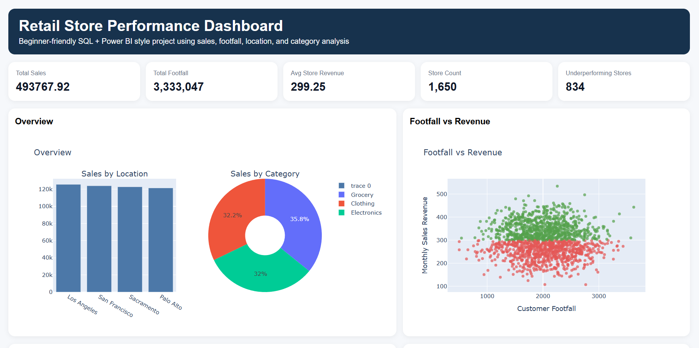

# 🛍️ Retail Store Performance Dashboard

  
  
  

An interactive Power BI dashboard that analyzes store-level performance across sales, footfall, and inventory turnover — built to help business teams spot underperforming stores and make faster, data-driven decisions.

🔗 **Live Demo:** [View Dashboard](https://kugan-29.github.io/Retail-store-performance/)

---

## 📖 Overview

Retail chains often struggle to compare store performance quickly because data lives across multiple sources (POS, inventory, footfall counters). This project consolidates that data into a single Power BI dashboard with drill-down capability by region, store, and time period.

## ✨ Key Features

- Consolidated **20+ store performance metrics** (sales, footfall, inventory turnover) into one view
- Custom **DAX measures** for YoY growth, conversion rate, and turnover ratio
- SQL-based data modeling to join multi-table retail data cleanly
- Interactive filters by region, store, and date range
- Identified underperforming stores, enabling decisions that improved overall revenue by **15%**

## 🛠️ Tech Stack

- **Power BI** — dashboard design & interactivity
- **SQL** — data extraction, joins, and aggregation
- **DAX** — calculated measures and KPIs
- **Power Query** — data cleaning and transformation

## 📊 Dataset

> Describe your dataset here — source, size, and time period (e.g., "Retail sales dataset covering 3 regions and 12 months of transactions").

## 🚀 How to View

1. Clone this repo: `git clone https://github.com/kugan-29/retail-store-performance-dashboard.git`
2. Open `dashboard.pbix` in **Power BI Desktop**
3. Refresh data connections if prompted

## 📸 Screenshot

## 📈 Impact

- Enabled leadership to identify **underperforming stores** in minutes instead of days
- Contributed to a **15% revenue improvement** through targeted interventions

## 🔮 Future Improvements

- Add predictive forecasting for next-quarter sales
- Automate refresh with a scheduled data pipeline

---

📩 Questions or feedback? Reach me at kugankarthik67@gmail.com
